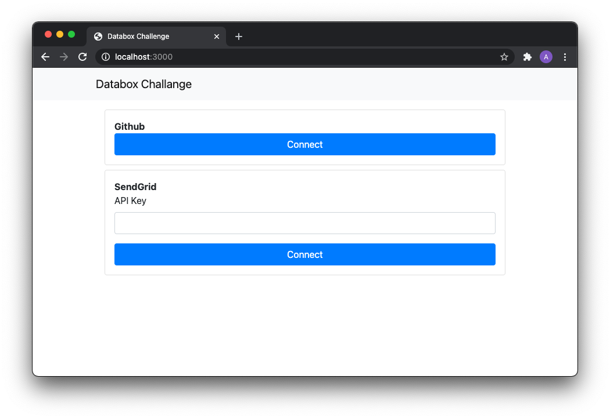
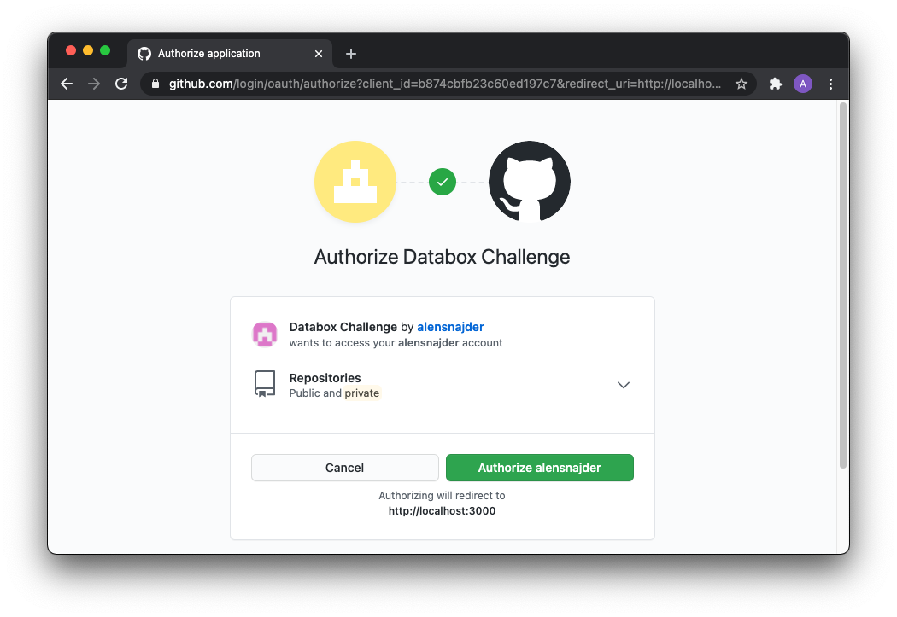
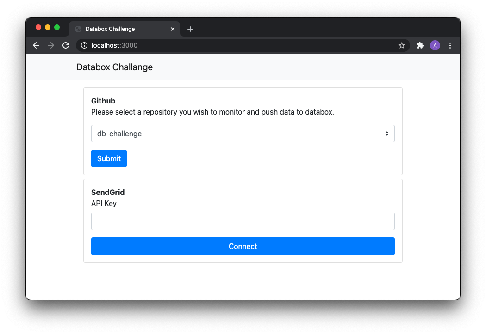
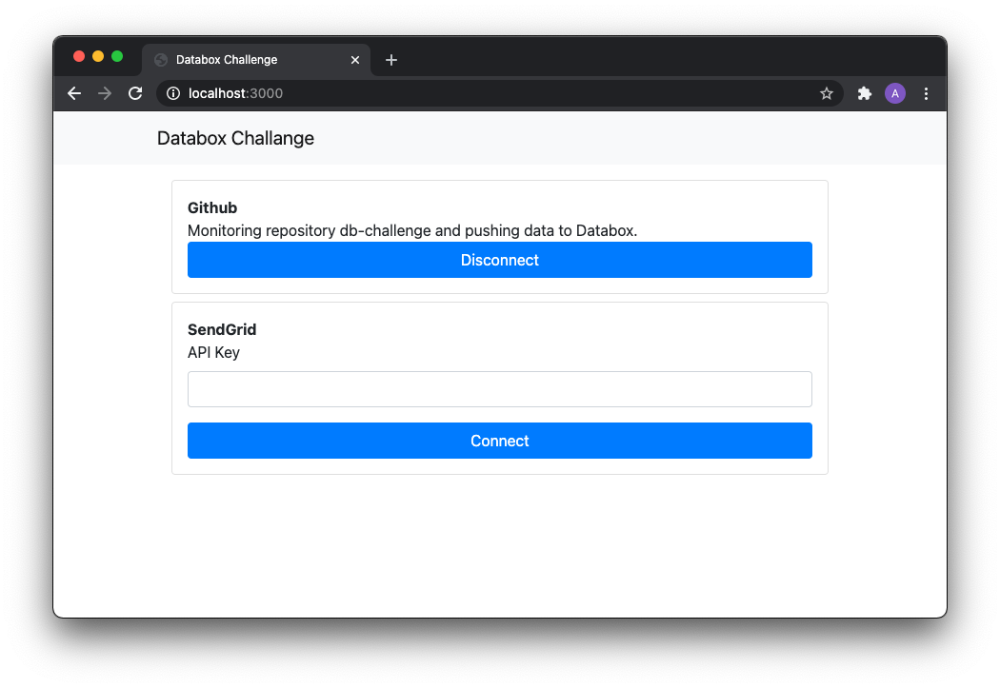
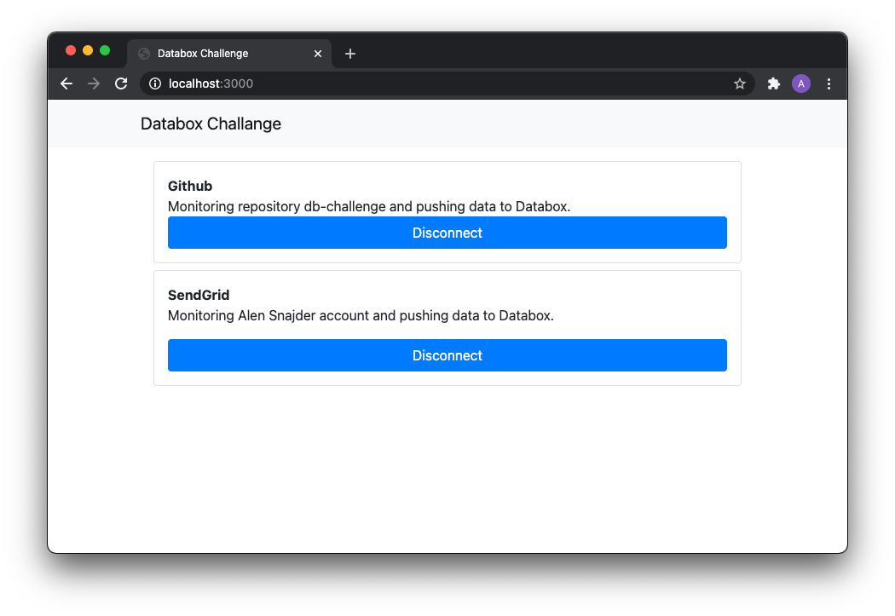
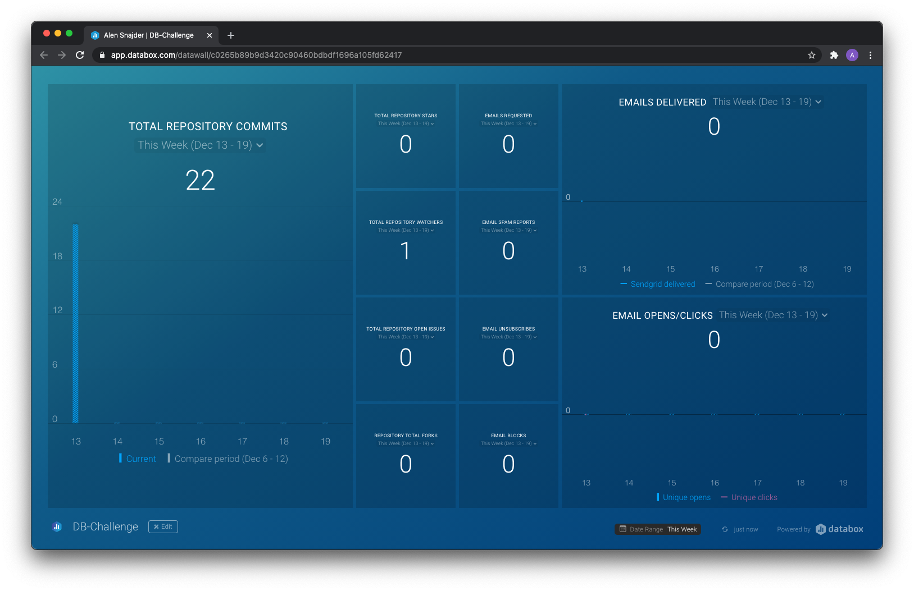

# DB-Challenge

## Installation

Clone repository

```
$ git clone https://github.com/alensnajder/db-challenge.git
```

Enter db-challenge directory

```
$ cd db-challenge
```

Install dependencies

```
$ npm install
```

Create a `.env` file and add required variables. For reference check [`.env.example`](https://github.com/alensnajder/db-challenge/blob/main/.env.example).

```
PORT=3000
GITHUB_CLIENT_ID=
GITHUB_CLIENT_SECRET=
DATABOX_GITHUB_KEY=
DATABOX_SENDGRID_KEY=
```

Run an application

```
$ npm start
```

Application user interface is accessible at `http://localhost:3000` (or port you specified in .env file).

## Test

```
$ npm test
```

## Supported data sources

### Github

#### Available metrics:

- Stars count
- Watchers count
- Forks count
- Open issues count
- Commits count

### SendGrid

#### Available metrics:

- Blocks
- Bounce drops
- Bounces
- Clicks
- Deferred
- Delivered
- Invalid emails
- Opens
- Processed
- Requests
- Spam reports drop
- Spam reports
- Unique clicks
- Unique opens
- Unsubscribe drops
- Unsubscribes

## Screenshots








## Used frameworks & libraries

- [axios](https://github.com/axios/axios)
- [databox](https://github.com/databox/databox-js)
- [dotenv](https://github.com/motdotla/dotenv)
- [express](https://github.com/expressjs/express)
- [jest](https://github.com/facebook/jest)
- [node-cron](https://github.com/node-cron/node-cron)
- [pug](https://github.com/pugjs/pug)
